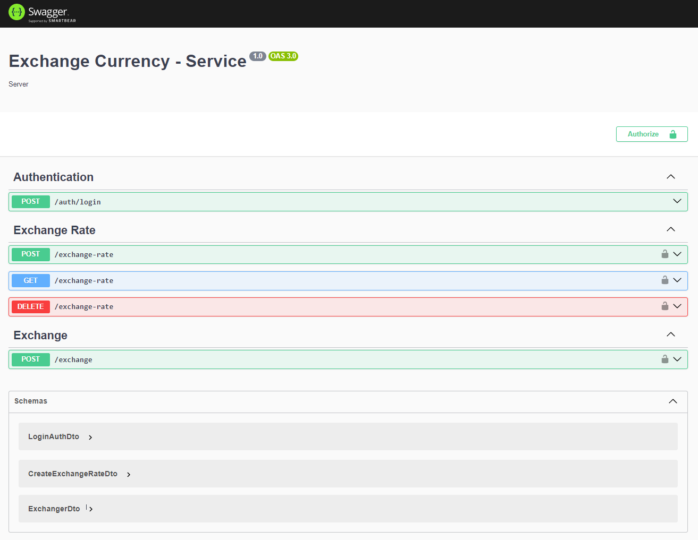

# Single NestJS with InMemory DB

## Description

This is a API Rest to exchange currencies, features:

- You need to generate a JWT token to use endpoints.
- You can add/update/remove exchange rates.
- You can exchange currency value to another currencies.

## Stack

- NestJSv10.
- Jwt
- FastifyAdapterv10
- Docker
- Jest
- Supertest

## Deploying with Docker

### Generate build image

```
docker build -t nestjs_in_memory_db .
```

### Running Build Container

```
docker run -d --name nestjs_in_memory_db_container -p 4000:4000 --env-file .env nestjs_in_memory_db
```

```bash
docker-compose --env-file .env.docker up -d --build
```

> ⚠️ **Warning:** Remover --build when container is built.

## Screenshot



## Populate Exchange rates

File populate.js get info from [FastForex](https://console.fastforex.io/). You can read more about doc in [this link](https://fastforex.readme.io/reference/introduction).

You need to get a API_KEY and run the file

```
node populate.js {YOUR_FOREX_API_KEY}
```

File includes static mock data, if you run this without api_key it populate with mock data

```
node populate.js
```
